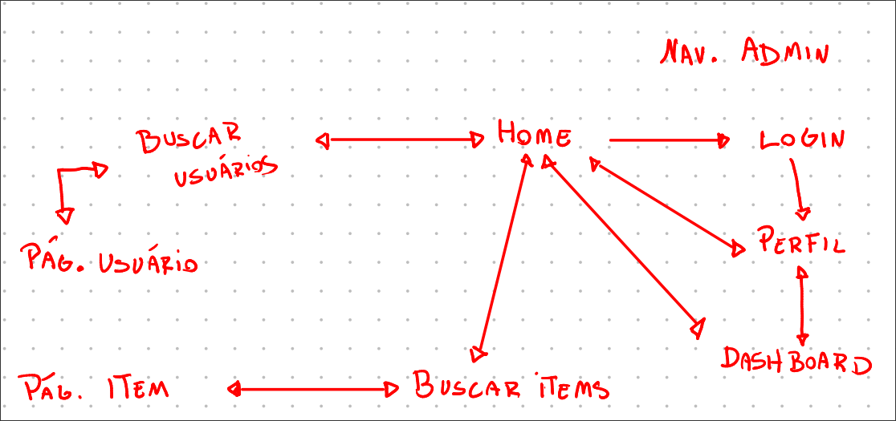

# Loja de eletrônicos
Alunos: Caio Capocasali da Silva - 12541733 e Renan Trofino Silva - 15522316

## Requisitos do sistema
O sistema de loja de produtos eletrônicos possui 3 entidades principais: usuários, produtos e compras.  
Usuários são divididos em usuários comuns e administradores, cada qual com suas permissões e funções no sistema. Usuários comuns realizam compras, buscam produtos, etc. Administradores cadastram outros usuários (ambos os tipos) e produtos.  
Produtos são adicionados ao sistema e podem ser comprados pelo usuário se existir estoque. Na compra, o usuário deve selecionar o cartão que deseja usar para o pagamento.  
Administradores possuem total controle sobre o estoque de produtos, podendo adicionar, alterar ou remover items.  
Todos os administradores têm acesso ao dashboard de vendas, que possibilita analisar dados de compras, produtos e usuários para gerar relatórios.  

### Modelo entidade-relacionamento para o sistema

Dados das entidades: 
- Admin: Id, nome, email, telefone
- Usuário: Id, nome, email, telefone, endereço
- Cartão: Id, id usuário, nome, número
- Produto: Id, nome, descrição, preço, quantidade estoque, marca, desconto (opcional, padrão 0), quantidade vendida, foto (armazena o caminho para a foto)
- Compra: Id, id usuário, id produtos, Id cartão, preço total, data da compra, status (aprovado, etc)
- Carrinho: Id, id usuário, id produtos

### Modelo de navegação (cliente e admin)

 

## Descrição do projeto

## Comentários sobre o código

## Plano de testes
Para executar teste do backend, plataformas como Postman e Insomnia podem ser úteis. A princípio, o código deve ser auto documentável, com o uso do Swagger, o que facilita testes na interface embutida (Swagger-ui).

## Resultados dos testes

## Instalação e execução

## Problemas

## Comentários adicionais
