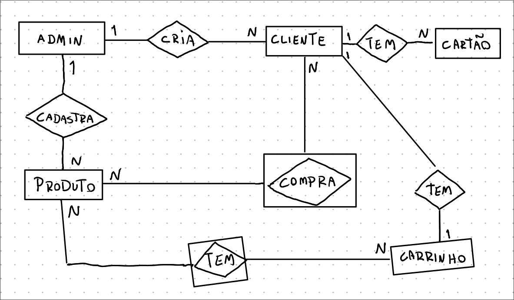
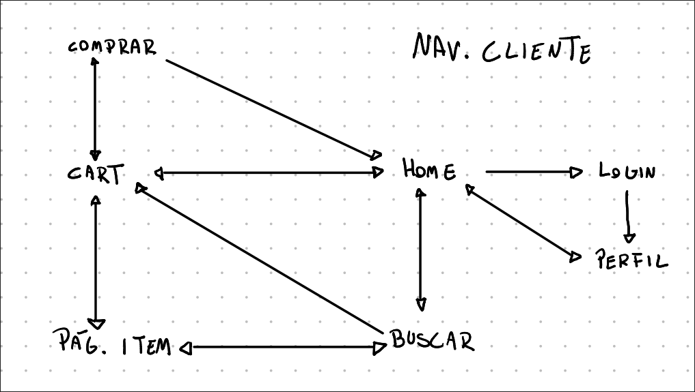

# Loja de eletrônicos
Alunos: Caio Capocasali da Silva - 12541733 e Renan Trofino Silva - 15522316

## Requisitos do sistema
O sistema de loja de produtos eletrônicos possui 3 entidades principais: usuários, produtos e compras. </br>
Usuários são divididos em usuários comuns e administradores, cada qual com suas permissões e funções no sistema. Usuários comuns realizam compras, buscam produtos, etc. Administradores cadastram outros usuários (ambos os tipos) e produtos. </br>
Produtos são adicionados ao sistema e podem ser comprados pelo usuário se existir estoque. Na compra, o usuário deve selecionar o cartão que deseja usar para o pagamento. </br>
Administradores possuem total controle sobre o estoque de produtos, podendo adicionar, alterar ou remover items. </br>
Todos os administradores têm acesso ao dashboard de vendas, que possibilita analisar dados de compras, produtos e usuários para gerar relatórios. </br>

### Modelo entidade-relacionamento para o sistema



Dados das entidades:</br>
- Admin: Id, nome, email, telefone
- Usuário: Id, nome, email, telefone, endereço
- Cartão: Id, id usuário, nome, número
- Produto: Id, nome, descrição, preço, quantidade estoque, marca, desconto (opcional, padrão 0), quantidade vendida, foto (armazena o caminho para a foto)
- Compra: Id, id usuário, id produtos, Id cartão, preço total, data da compra, status (aprovado, etc)
- Carrinho: Id, id usuário, id produtos

### Modelo de navegação (cliente e admin)

</br>


### Esquema da telas (designs e inspirações para implementação)
https://www.figma.com/design/m3WMZW8nlabPySLZ4R0j9Y/web?node-id=0-1&t=CwbLw7NK2zHSW6xv-1

## Descrição do projeto
A loja online de produtos elêtronicos será implementada usando React + Tailwindcss (frontend) e Bun.js + Fastify (backend). </br>
Os dados serão armazenados em um banco de dados, acessado pelo servidor. </br>

### Casos de uso - Administrador
Um admin pode: </br>
- Gerenciar (criar, atualizar, excluir e buscar) produtos
- Gerenciar (criar, atualizar, excluir e buscar) usuários
- Analisar dados de compras já realizadas
- Editar seus próprios dados (alterar senha, etc)

### Casos de uso - Cliente
Um cliente pode: </br>
- Buscar produtos
- Adicionar/excluir produtos em seu carrinho de compras
- Gerenciar (criar, atualizar, excluir e buscar) seus cartões
- Comprar os items em seu carrinho
- Ver compras já realizadas
- Editar seus próprios dados (alterar senha, ect)

### Casos de uso - Cartões do usuário
- O usuário pode gerenciar seus cartões
- Para realizar compras, pelo menos um cartão deve estar cadastrado

### Casos de uso - Produto
- Produtos são criados por administradores
- O estoque e o número de vendas de um produto é atualizado a cada compra que envolva-o
- Administradores podem atribuir descontos aos produtos
- Produtos sem estoque podem ser buscados e exibidos, mas não comprados

### Casos de uso - Cart
- Todo usuário possui um carrinho de compras único e próprio
- O usuário pode adicionar e remover items do carrinho
- Items fora de estoque são excluídos do carrinho
- O carrinho deve somar os valores e aplicar os descontos (se houverem) no total da compra

### Casos de uso - Compra
- Uma compra só pode ser realizada via carrinho de compras
- Caso um item da compra esteja indisponível, o mesmo é retirado da compra e seu valor subtraído
- Caso o usuário não possua cartões, a compra não pode prosseguir
- Ao finalizar uma compra, o carrinho é esvaziado e os produtos são atualizados no estoque

### Casos de uso - Dashboard
- Um admin pode buscar dados de compras na base de dados
- Resultados são exibidos via gráfico ou arquivo para download

## Comentários sobre o código

## Plano de testes
Para executar teste do backend, plataformas como Postman e Insomnia podem ser úteis. A princípio, o código deve ser auto documentável, com o uso do Swagger, o que facilita testes na interface embutida (Swagger-ui).

## Resultados dos testes

## Instalação e execução
Clone este reposiório. </br>
<br/>
Backend (rodando em localhost:3000):</br>
```
cd backend/
```
```
bun install
```
```
bun run dev
```
<br/>
Frontend (rodando em localhost:5173):</br>

```
cd frontend/
```
```
bun install
```
```
bun run dev
```

## Problemas

## Comentários adicionais
Para facilitar o desenvolvimento, as seguintes bibliotecas/frameworks forma utilizadas: <br/>
- React + Vite + Bun (webpack de desenvolvimento)
- Tailwindcss (estilos)
- Shadcn/ui (componentes estilizados)
- Zod + React Hook Form (esquemas e validação de formulários)
- Tanstack Router (roteamento/páginas)
- Tanstack Query (consumo de APIs e caching)
